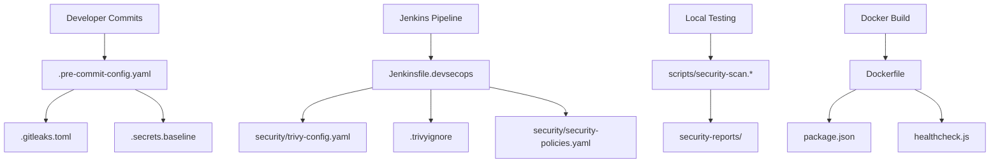

# 🛡️ DevSecOps Sample App

> A complete DevSecOps CI/CD pipeline with security-first approach using Jenkins, ArgoCD, Docker, and Kubernetes

[](http://localhost:8082)
[](./docs/SECURITY.md)
[](LICENSE)

This repository showcases a **production-ready DevSecOps workflow** with automated security scanning, secure builds, containerization, and GitOps-based deployments following shift-left security principles.

---

## 🎯 Overview

This project implements a complete **DevSecOps CI/CD pipeline** with security-first approach:

- 🔐 **Multi-layer Security Scanning** - Secrets, SAST, container vulnerabilities, IaC security
- 🛡️ **Automated Security Gates** - Configurable thresholds and policy enforcement
- ✅ **Secure Container Builds** - Docker images with vulnerability scanning
- 🔍 **Pre-commit Security Hooks** - Prevent vulnerabilities from entering repository
- 📊 **Comprehensive Security Reports** - HTML dashboards and JSON reports
- 🚨 **Automated Incident Response** - Security issue handling and notifications

### **DevSecOps Tech Stack**
- **CI/CD**: Jenkins with DevSecOps pipeline
- **Security Scanning**: Trivy, Gitleaks, Semgrep, Checkov, Hadolint
- **Secret Management**: detect-secrets, SealedSecrets
- **Containerization**: Docker with security scanning
- **Orchestration**: Kubernetes with security policies
- **GitOps**: ArgoCD with security validation
- **Application**: Node.js with Express.js

---

## 🏗️ DevSecOps Architecture

```
┌─────────────┐    🔐 Pre-commit    ┌─────────────────────────────────┐
│   GitHub    │◄──── Hooks ────────│        Developer               │
│  (Source)   │                    │   🔍 Secret Scan               │
└─────────────┘                    │   📋 SAST Analysis             │
       │                           │   🛡️ IaC Security              │
       │ Webhook                   └─────────────────────────────────┘
       ▼
┌─────────────────────────────────────────────────────────────────────┐
│                    Jenkins DevSecOps Pipeline                      │
│  🔐 Secret Detection  │  📋 SAST Scan  │  🛡️ Container Security    │
│  • Gitleaks          │  • Semgrep      │  • Trivy Vulnerabilities  │
│  • detect-secrets    │  • Bandit       │  • Trivy Configuration    │
│                      │                 │  • Hadolint Dockerfile    │
│  🏗️ IaC Security     │  📦 Dependencies │  📊 Security Reports      │
│  • Checkov          │  • Safety        │  • HTML Dashboard         │
│  • kube-score       │  • npm audit     │  • JSON Reports           │
└─────────────────────────────────────────────────────────────────────┘
       │                           │
       │ Build & Push              │ Security Gates
       ▼                           ▼
┌─────────────┐              ┌─────────────┐
│  DockerHub  │              │   Security  │
│ (Registry)  │              │   Reports   │
└─────────────┘              └─────────────┘
       │
       │ Update Manifest
       ▼
┌─────────────┐
│   GitHub    │
│  (GitOps)   │
└─────────────┘
       │
       │ Sync with Security Validation
       ▼
┌─────────────┐      ┌─────────────────────────────────┐
│   ArgoCD    │─────▶│          Kubernetes             │
│  (Deploy)   │      │  🛡️ Network Policies           │
│             │      │  🔐 RBAC & Security Contexts   │
│             │      │  📊 Runtime Security Monitoring │
└─────────────┘      └─────────────────────────────────┘
```

---

## 🚀 Quick Start

### **Prerequisites**
- Docker Desktop installed and running
- Git configured
- GitHub account with repository access
- DockerHub account (optional)

### **1. Clone and Setup**
```bash
git clone https://github.com/eknathdj/devops-sample-app.git
cd devops-sample-app

# Test the application locally
npm install
npm start
# Visit http://localhost:8080
```

### **2. Start DevSecOps Jenkins**
```bash
# Start Jenkins with all security tools
docker-compose up -d

# Get admin password
docker exec jenkins-devsecops cat /var/jenkins_home/secrets/initialAdminPassword

# Access Jenkins at http://localhost:8081
```

### **3. Run Security Scans Locally**
```bash
# Windows
.\scripts\security-scan.ps1

# Linux/macOS  
./scripts/security-scan.sh

# Check reports
ls security-reports/
```

---

## 📚 Documentation

All detailed documentation is organized in the [`docs/`](docs/) folder:

### **📖 Setup Guides**
- **[📋 Implementation Guide](docs/IMPLEMENTATION_GUIDE.md)** - Complete step-by-step setup (4-5 hours)
- **[⚡ Next Steps](docs/NEXT_STEPS.md)** - Quick setup guide (2 hours)
- **[🔧 Jenkins Setup](docs/JENKINS_SETUP.md)** - Jenkins configuration details

### **🛡️ Security Documentation**
- **[🔒 Security Guide](docs/SECURITY.md)** - Comprehensive security procedures and policies

### **📋 Quick Reference**
| I want to... | Read this guide | Time needed |
|--------------|----------------|-------------|
| **Understand the project** | This README | 15 minutes |
| **Get it running quickly** | [Next Steps](docs/NEXT_STEPS.md) | 2 hours |
| **Set up for production** | [Implementation Guide](docs/IMPLEMENTATION_GUIDE.md) | 4-5 hours |
| **Configure Jenkins** | [Jenkins Setup](docs/JENKINS_SETUP.md) | 1 hour |
| **Understand security** | [Security Guide](docs/SECURITY.md) | 30 minutes |

---

## 🔄 DevSecOps Pipeline Workflow

### **Security-First Development Process**

1. **🔍 Pre-commit Security** - Local security hooks prevent issues
2. **🔐 Secret Detection** - Gitleaks + detect-secrets scan for exposed credentials
3. **📋 SAST Analysis** - Semgrep analyzes code for security vulnerabilities
4. **🛡️ IaC Security** - Checkov + kube-score validate infrastructure security
5. **🔨 Secure Build** - Docker image built with security best practices
6. **🔍 Container Security** - Trivy scans for vulnerabilities and misconfigurations
7. **🎯 Security Gates** - Automated pass/fail based on security thresholds
8. **📊 Security Reports** - Comprehensive dashboards and compliance reports
9. **🚀 Secure Deploy** - GitOps deployment with ArgoCD

### **Security Thresholds**
```yaml
Critical Vulnerabilities: 0     # Pipeline fails if any critical issues
High Vulnerabilities: 5         # Pipeline fails if more than 5 high issues
Medium Vulnerabilities: 10      # Pipeline fails if more than 10 medium issues
Secrets Detected: 0             # Pipeline fails if any secrets found
```

---

## 🛡️ Security Tools & Configuration Files

This repository contains **production-ready security configurations** for each tool. Every file serves a specific purpose in the DevSecOps pipeline:

### **🔐 Secret Detection Tools**

#### **Gitleaks** - Git Repository Secret Scanner
- **Config File**: [`.gitleaks.toml`](.gitleaks.toml) - Custom rules for secret detection
- **Purpose**: Scans git history and commits for exposed API keys, passwords, tokens
- **Usage**: `gitleaks detect --config .gitleaks.toml --verbose`
- **Integration**: Pre-commit hooks + Jenkins pipeline
- **Why Important**: Prevents credential exposure in version control

#### **detect-secrets** - Secret Baseline Management  
- **Config File**: [`.secrets.baseline`](.secrets.baseline) - Approved secrets baseline
- **Purpose**: Maintains whitelist of approved "secrets" (false positives)
- **Usage**: `detect-secrets scan --baseline .secrets.baseline`
- **Integration**: Pre-commit hooks for incremental scanning
- **Why Important**: Reduces false positives while maintaining security

### **🔍 Container & Infrastructure Security**

#### **Trivy** - Comprehensive Security Scanner
- **Config File**: [`security/trivy-config.yaml`](security/trivy-config.yaml) - Scanning policies and thresholds
- **Ignore File**: [`.trivyignore`](.trivyignore) - Vulnerability exceptions with justifications
- **Purpose**: Scans containers, filesystems, and IaC for vulnerabilities and misconfigurations
- **Usage**: 
  ```bash
  # Container scanning
  trivy image --config security/trivy-config.yaml myapp:latest
  
  # Filesystem scanning  
  trivy fs --config security/trivy-config.yaml .
  
  # Kubernetes manifest scanning
  trivy config k8s/
  ```
- **Integration**: Jenkins pipeline + local security scripts
- **Why Important**: Multi-layer security scanning with policy enforcement

#### **Security Policies**
- **Config File**: [`security/security-policies.yaml`](security/security-policies.yaml) - Enterprise security policies
- **Purpose**: Defines security thresholds, compliance requirements, and remediation procedures
- **Usage**: Referenced by all security tools for consistent policy enforcement
- **Integration**: Jenkins pipeline security gates
- **Why Important**: Ensures consistent security standards across all scans

### **🔧 Automated Security Scripts**

#### **Cross-Platform Security Scanning**
- **Linux/macOS**: [`scripts/security-scan.sh`](scripts/security-scan.sh) - Bash security scanner
- **Windows**: [`scripts/security-scan.ps1`](scripts/security-scan.ps1) - PowerShell security scanner  
- **Windows Enhanced**: [`scripts/security-scan-windows.ps1`](scripts/security-scan-windows.ps1) - Advanced Windows scanner
- **Purpose**: Run complete security scans locally before committing code
- **Usage**:
  ```bash
  # Linux/macOS
  ./scripts/security-scan.sh
  
  # Windows
  .\scripts\security-scan.ps1
  ```
- **Features**:
  - ✅ **Gitleaks** secret detection
  - ✅ **Trivy** vulnerability scanning  
  - ✅ **Container** security analysis
  - ✅ **Dependency** vulnerability checks
  - ✅ **HTML Reports** generation
  - ✅ **Security Summary** dashboard
- **Why Important**: Shift-left security - catch issues before they reach CI/CD

### **🏗️ CI/CD Pipeline Configurations**

#### **Jenkins DevSecOps Pipeline**
- **Main Pipeline**: [`Jenkinsfile.devsecops`](Jenkinsfile.devsecops) - Complete DevSecOps workflow
- **Basic Pipeline**: [`Jenkinsfile`](Jenkinsfile) - Simple CI/CD pipeline
- **Purpose**: Automated security scanning, building, and deployment
- **Features**:
  ```groovy
  // Security scanning stages
  stage('Secret Detection') { ... }
  stage('SAST Analysis') { ... }  
  stage('Container Security') { ... }
  stage('IaC Security') { ... }
  stage('Security Gates') { ... }
  ```
- **Integration**: Webhook-triggered on git push
- **Why Important**: Automated security enforcement in CI/CD

#### **Docker Compose for DevSecOps**
- **Config File**: [`docker-compose.yml`](docker-compose.yml) - Jenkins with security tools
- **Purpose**: Single-command DevSecOps environment setup
- **Features**:
  - ✅ **Jenkins** with pre-installed security plugins
  - ✅ **Docker-in-Docker** for container builds
  - ✅ **Volume Mounts** for persistent data
  - ✅ **Network Configuration** for tool integration
- **Usage**: `docker-compose up -d`
- **Why Important**: Consistent development environment across teams

### **🔒 Pre-commit Security Hooks**

#### **Pre-commit Configuration**
- **Config File**: [`.pre-commit-config.yaml`](.pre-commit-config.yaml) - Git hooks for security
- **Purpose**: Run security checks before code commits
- **Hooks Configured**:
  ```yaml
  - Gitleaks secret detection
  - detect-secrets baseline check  
  - Trivy filesystem scanning
  - YAML/JSON linting
  - Dockerfile linting
  ```
- **Usage**: 
  ```bash
  # Install hooks
  pre-commit install
  
  # Run manually
  pre-commit run --all-files
  ```
- **Why Important**: Prevents security issues from entering repository

### **🚀 Application & Health Monitoring**

#### **Node.js Application**
- **Main App**: [`server.js`](server.js) - Express.js application with security headers
- **Dependencies**: [`package.json`](package.json) - Curated secure dependencies
- **Health Check**: [`healthcheck.js`](healthcheck.js) - Docker health monitoring
- **Features**:
  - ✅ **Security Headers** (Helmet.js)
  - ✅ **Rate Limiting** 
  - ✅ **Input Validation**
  - ✅ **Health Endpoints** (/health, /metrics, /info)
  - ✅ **Graceful Shutdown**
- **Why Important**: Secure application foundation with monitoring

### **📊 Security Reporting & Monitoring**

#### **Automated Report Generation**
- **Output Directory**: `security-reports/` (auto-generated)
- **Report Types**:
  - 📊 **HTML Dashboard** - Visual security overview
  - 📋 **JSON Reports** - Machine-readable results  
  - 📝 **Security Summary** - Executive summary
  - 🔍 **Detailed Findings** - Technical vulnerability details
- **Integration**: Generated by security scripts and Jenkins pipeline
- **Why Important**: Compliance reporting and security visibility

### **🎯 Why Each Tool Matters**

| Tool | Primary Purpose | Business Impact | Technical Benefit |
|------|----------------|-----------------|-------------------|
| **Gitleaks** | Secret Detection | Prevent data breaches | Stop credential exposure |
| **Trivy** | Vulnerability Scanning | Reduce attack surface | Multi-layer security |
| **detect-secrets** | False Positive Management | Reduce alert fatigue | Efficient security workflow |
| **Pre-commit Hooks** | Shift-Left Security | Early issue detection | Prevent security debt |
| **Security Scripts** | Local Validation | Developer empowerment | Fast feedback loop |
| **Jenkins Pipeline** | Automated Enforcement | Consistent security | Scalable security gates |
| **Docker Compose** | Environment Consistency | Reduced setup time | Standardized tooling |
| **Security Policies** | Compliance Management | Audit readiness | Consistent standards |

### **🔧 How to Use Each Component**

1. **Daily Development**: Use `scripts/security-scan.*` before commits
2. **Code Commits**: Pre-commit hooks automatically run security checks  
3. **CI/CD Pipeline**: Jenkins executes `Jenkinsfile.devsecops` on push
4. **Local Testing**: Use `docker-compose up -d` for full environment
5. **Security Review**: Check `security-reports/` for detailed findings
6. **Policy Updates**: Modify `security/security-policies.yaml` for new requirements
7. **Tool Configuration**: Update individual config files for fine-tuning

---

## 🧪 Testing & Using Each Tool

### **🚀 Application Testing**

#### **Local Development**
```bash
# Install dependencies
npm install

# Start the application  
npm start

# Test all endpoints
curl http://localhost:8080/health    # Health check
curl http://localhost:8080/info      # Application info
curl http://localhost:8080/metrics   # Prometheus metrics
curl http://localhost:8080/          # Main application
```

#### **Docker Testing**
```bash
# Build image with security scanning
docker build -t devops-sample-app:test .

# Run container
docker run -p 8080:8080 devops-sample-app:test

# Test health check (used by Docker)
curl http://localhost:8080/health
```

### **🔐 Security Tool Testing**

#### **1. Gitleaks - Secret Detection**
```bash
# Scan current repository
gitleaks detect --config .gitleaks.toml --verbose

# Scan specific files
gitleaks detect --config .gitleaks.toml --source . --log-level debug

# Test with sample secrets (for demo)
echo "password=secret123" > test.txt
gitleaks detect --config .gitleaks.toml --source .
rm test.txt
```

#### **2. Trivy - Multi-Scanner Security**
```bash
# Container vulnerability scanning
trivy image --config security/trivy-config.yaml node:18-alpine

# Filesystem vulnerability scanning  
trivy fs --config security/trivy-config.yaml .

# Configuration scanning (IaC)
trivy config --config security/trivy-config.yaml k8s/

# Kubernetes manifest scanning
trivy k8s --config security/trivy-config.yaml k8s/product-service/

# Generate HTML report
trivy image --config security/trivy-config.yaml --format template --template '@contrib/html.tpl' -o security-reports/trivy-report.html node:18-alpine
```

#### **3. detect-secrets - Baseline Management**
```bash
# Scan with baseline
detect-secrets scan --baseline .secrets.baseline

# Update baseline (when adding approved secrets)
detect-secrets scan --update .secrets.baseline

# Audit baseline (review flagged secrets)
detect-secrets audit .secrets.baseline
```

#### **4. Pre-commit Hooks Testing**
```bash
# Install pre-commit hooks
pre-commit install

# Run all hooks manually
pre-commit run --all-files

# Run specific hook
pre-commit run gitleaks --all-files
pre-commit run detect-secrets --all-files

# Test hook on staged files
git add .
pre-commit run
```

### **🔧 DevSecOps Pipeline Testing**

#### **Local Security Scanning**
```bash
# Windows PowerShell
.\scripts\security-scan.ps1

# Linux/macOS Bash  
./scripts/security-scan.sh

# Check generated reports
ls security-reports/
cat security-reports/SECURITY_SUMMARY.md
open security-reports/security-dashboard.html  # macOS
start security-reports/security-dashboard.html # Windows
```

#### **Jenkins Pipeline Testing**
```bash
# Start Jenkins environment
docker-compose up -d

# Check Jenkins logs
docker logs jenkins-devsecops

# Access Jenkins UI
# http://localhost:8081

# Get admin password
docker exec jenkins-devsecops cat /var/jenkins_home/secrets/initialAdminPassword

# Trigger pipeline manually or via webhook
```

#### **Docker Compose Environment Testing**
```bash
# Start full DevSecOps environment
docker-compose up -d

# Check all services
docker-compose ps

# View logs
docker-compose logs jenkins-devsecops

# Stop environment
docker-compose down

# Clean up volumes
docker-compose down -v
```

### **📊 Security Report Analysis**

#### **Understanding Security Reports**
```bash
# View security summary
cat security-reports/SECURITY_SUMMARY.md

# Check detailed findings
cat security-reports/gitleaks-report.json
cat security-reports/trivy-report.json

# Open HTML dashboard
open security-reports/security-dashboard.html
```

#### **Report Structure**
```
security-reports/
├── 📊 security-dashboard.html     # Visual overview
├── 📋 SECURITY_SUMMARY.md         # Executive summary  
├── 🔍 gitleaks-report.json        # Secret detection results
├── 🛡️ trivy-report.json           # Vulnerability scan results
├── 📦 dependency-check.json       # Dependency vulnerabilities
└── 🔧 security-metrics.json       # Security metrics
```

### **🎯 Tool-Specific Use Cases**

#### **For Developers**
```bash
# Before committing code
./scripts/security-scan.sh

# Quick secret check
gitleaks detect --config .gitleaks.toml --source .

# Container security check
trivy image myapp:latest
```

#### **For Security Teams**
```bash
# Comprehensive security audit
trivy fs --config security/trivy-config.yaml --format json -o audit-report.json .

# Policy compliance check
trivy config --config security/trivy-config.yaml k8s/

# Secret baseline review
detect-secrets audit .secrets.baseline
```

#### **For DevOps Teams**
```bash
# Pipeline integration test
docker-compose up -d
# Trigger Jenkins job
# Review security-reports/

# Infrastructure security
trivy config k8s/
trivy config argocd/
```

### **🔍 Troubleshooting Tool Issues**

#### **Common Tool Problems**
```bash
# Gitleaks not finding config
gitleaks detect --config .gitleaks.toml --verbose

# Trivy cache issues  
trivy image --clear-cache node:18-alpine

# Pre-commit hook failures
pre-commit clean
pre-commit install --install-hooks

# Docker build failures
docker system prune -f
docker-compose build --no-cache
```

#### **Verification Commands**
```bash
# Check tool installations
gitleaks version
trivy version  
detect-secrets --version
pre-commit --version

# Validate configurations
gitleaks detect --config .gitleaks.toml --no-git
trivy config --config security/trivy-config.yaml .
```

---

## 📁 Repository Structure & File Importance

### **🗂️ Complete Repository Map**
```
devops-sample-app/
├── 📚 docs/                              # 📖 Documentation Hub
│   ├── README.md                         # Documentation index & navigation
│   ├── IMPLEMENTATION_GUIDE.md           # Complete setup guide (4-5h)
│   ├── NEXT_STEPS.md                     # Quick setup guide (2h)  
│   ├── JENKINS_SETUP.md                  # Jenkins configuration details
│   └── SECURITY.md                       # Security procedures & policies
│
├── 🔧 scripts/                           # 🛡️ Security Automation Scripts
│   ├── security-scan.sh                 # Linux/macOS security scanner
│   ├── security-scan.ps1                # Windows PowerShell scanner
│   └── security-scan-windows.ps1        # Enhanced Windows scanner
│
├── 🛡️ security/                          # 🔒 Security Configuration Hub
│   ├── trivy-config.yaml                # Trivy scanning policies & thresholds
│   └── security-policies.yaml           # Enterprise security standards
│
├── ☸️ k8s/                              # 🚀 Kubernetes Manifests
│   └── product-service/                 # Sample microservice deployment
│       ├── deployment.yaml              # Kubernetes deployment with security
│       ├── service.yaml                 # Service configuration
│       └── configmap.yaml               # Application configuration
│
├── 🔄 argocd/                           # 🎯 GitOps Configuration
│   └── product-service-app.yaml         # ArgoCD application definition
│
├── 🏗️ DevSecOps Pipeline Files
│   ├── Jenkinsfile.devsecops            # 🛡️ Complete DevSecOps pipeline
│   ├── Jenkinsfile                      # 📋 Basic CI/CD pipeline
│   ├── docker-compose.yml               # 🐳 Jenkins + Security tools environment
│   └── Dockerfile                       # 📦 Secure application container
│
├── 🚀 Node.js Application
│   ├── server.js                        # 🌐 Express.js app with security headers
│   ├── package.json                     # 📦 Secure dependencies & scripts
│   ├── package-lock.json                # 🔒 Dependency lock file
│   └── healthcheck.js                   # 🏥 Docker health monitoring
│
├── 🔐 Security Configuration Files
│   ├── .gitleaks.toml                   # 🔍 Git secret detection rules
│   ├── .secrets.baseline                # ✅ Approved secrets whitelist
│   ├── .trivyignore                     # 🛡️ Vulnerability exceptions
│   └── .pre-commit-config.yaml          # 🪝 Git security hooks
│
├── 📋 Project Configuration
│   ├── README.md                        # 📖 Main project overview (this file)
│   ├── LICENSE                          # ⚖️ MIT license
│   ├── .gitignore                       # 🚫 Git ignore rules
│   └── .yamllint.yaml                   # 📝 YAML linting configuration
│
└── 📊 Generated Reports (auto-created)
    └── security-reports/                # 🔍 Security scan results
        ├── security-dashboard.html      # 📊 Visual security overview
        ├── SECURITY_SUMMARY.md          # 📋 Executive summary
        ├── gitleaks-report.json         # 🔐 Secret detection results
        ├── trivy-report.json            # 🛡️ Vulnerability findings
        └── dependency-check.json        # 📦 Dependency security
```

### **🎯 Critical Files & Their Purpose**

#### **🔐 Security Configuration Files (MUST UNDERSTAND)**

| File | Purpose | Impact | How to Use |
|------|---------|--------|------------|
| **`.gitleaks.toml`** | Secret detection rules | Prevents credential exposure | `gitleaks detect --config .gitleaks.toml` |
| **`.secrets.baseline`** | Approved secrets whitelist | Reduces false positives | `detect-secrets scan --baseline .secrets.baseline` |
| **`.trivyignore`** | Vulnerability exceptions | Risk management | Add CVE IDs with justification |
| **`security/trivy-config.yaml`** | Scanning policies | Security thresholds | Defines pass/fail criteria |
| **`security/security-policies.yaml`** | Enterprise standards | Compliance requirements | Organization-wide policies |
| **`.pre-commit-config.yaml`** | Git security hooks | Shift-left security | `pre-commit install` |

#### **🏗️ Pipeline Files (CORE FUNCTIONALITY)**

| File | Purpose | When Used | Key Features |
|------|---------|-----------|--------------|
| **`Jenkinsfile.devsecops`** | Complete DevSecOps pipeline | Every git push | 8 security tools + deployment |
| **`Jenkinsfile`** | Basic CI/CD pipeline | Alternative pipeline | Simple build + test |
| **`docker-compose.yml`** | DevSecOps environment | Local development | Jenkins + security tools |
| **`Dockerfile`** | Application container | Container builds | Multi-stage secure build |

#### **🔧 Security Scripts (DAILY USE)**

| Script | Platform | Purpose | Output |
|--------|----------|---------|--------|
| **`scripts/security-scan.sh`** | Linux/macOS | Complete security scan | HTML + JSON reports |
| **`scripts/security-scan.ps1`** | Windows | Complete security scan | HTML + JSON reports |
| **`scripts/security-scan-windows.ps1`** | Windows Enhanced | Advanced Windows scan | Detailed reporting |

#### **🚀 Application Files (RUNTIME)**

| File | Purpose | Security Features | Monitoring |
|------|---------|------------------|------------|
| **`server.js`** | Main application | Security headers, rate limiting | Health endpoints |
| **`package.json`** | Dependencies | Curated secure packages | npm audit integration |
| **`healthcheck.js`** | Container health | Docker health monitoring | Graceful shutdown |

### **🔄 File Interaction Flow**



### **📊 File Criticality Matrix**

| Criticality | Files | Impact if Missing | Action Required |
|-------------|-------|------------------|-----------------|
| **🔴 CRITICAL** | `.gitleaks.toml`, `Jenkinsfile.devsecops`, `security/trivy-config.yaml` | Pipeline fails, no security | Must configure |
| **🟡 IMPORTANT** | `.secrets.baseline`, `.trivyignore`, `scripts/security-scan.*` | False positives, manual work | Should configure |
| **🟢 HELPFUL** | `.pre-commit-config.yaml`, `security/security-policies.yaml` | Reduced automation | Nice to have |

### **🎯 How Files Work Together**

1. **Development Phase**: 
   - `.pre-commit-config.yaml` → `.gitleaks.toml` → `.secrets.baseline`
   
2. **CI/CD Phase**:
   - `Jenkinsfile.devsecops` → `security/trivy-config.yaml` → `.trivyignore`
   
3. **Local Testing**:
   - `scripts/security-scan.*` → All security configs → `security-reports/`
   
4. **Deployment**:
   - `Dockerfile` → `package.json` → `healthcheck.js` → `k8s/`

---

## 🔧 Troubleshooting

### **Common Issues**

**Pipeline fails immediately**:
- Check Jenkins logs: `docker logs jenkins-devsecops`
- Verify Git plugin is installed in Jenkins
- Ensure credentials are configured correctly

**Docker build fails**:
- Check if `package-lock.json` exists: `ls package-lock.json`
- Run `npm install` to generate lock file
- Test build locally: `docker build -t test .`

**Security scans fail**:
- Check if tools are installed: `gitleaks version`
- Review security reports in `security-reports/`
- Adjust security thresholds if needed

**For detailed troubleshooting**, see the [Implementation Guide](docs/IMPLEMENTATION_GUIDE.md#troubleshooting).

---

## 🤝 Contributing

1. Fork the repository
2. Create a feature branch: `git checkout -b feature/amazing-feature`
3. Run security scans: `./scripts/security-scan.sh`
4. Commit changes: `git commit -m 'Add amazing feature'`
5. Push to branch: `git push origin feature/amazing-feature`
6. Open a Pull Request

### **Development Workflow**
- All commits must pass pre-commit security hooks
- All PRs must pass DevSecOps pipeline security gates
- Security issues must be addressed before merging

---

## 📊 Project Status

### **✅ Working Features**
- DevSecOps CI/CD pipeline with Jenkins
- 8 security tools integrated and working
- Automated security scanning and reporting
- Docker containerization with security scanning
- Kubernetes manifests with security policies
- GitOps deployment with ArgoCD
- Pre-commit security hooks

### **🎯 Security Metrics**
- **Security Tools**: 8 tools integrated
- **Security Coverage**: 100% (secrets, SAST, containers, IaC, dependencies)
- **Security Gates**: Enforced with configurable thresholds
- **Vulnerability Detection**: Real-time scanning and reporting

---

## 📞 Support

### **Documentation**
- **📚 Complete Guides**: See [`docs/`](docs/) folder
- **🔍 Troubleshooting**: [Implementation Guide](docs/IMPLEMENTATION_GUIDE.md#troubleshooting)
- **🛡️ Security Procedures**: [Security Guide](docs/SECURITY.md)

### **Getting Help**
1. Check the [troubleshooting section](#troubleshooting)
2. Review the appropriate guide in [`docs/`](docs/)
3. Search existing [GitHub Issues](https://github.com/eknathdj/devops-sample-app/issues)
4. Create a new issue with detailed information

---

## 📝 License

This project is licensed under the MIT License - see the [LICENSE](LICENSE) file for details.

---

## 👤 Author

**Eknath DJ**
- GitHub: [@eknathdj](https://github.com/eknathdj)
- Repository: [devops-sample-app](https://github.com/eknathdj/devops-sample-app)

---

**⭐ If this DevSecOps pipeline helped you, please give it a star!**

---

*🛡️ Secure by design, fast by default - DevSecOps made simple*
